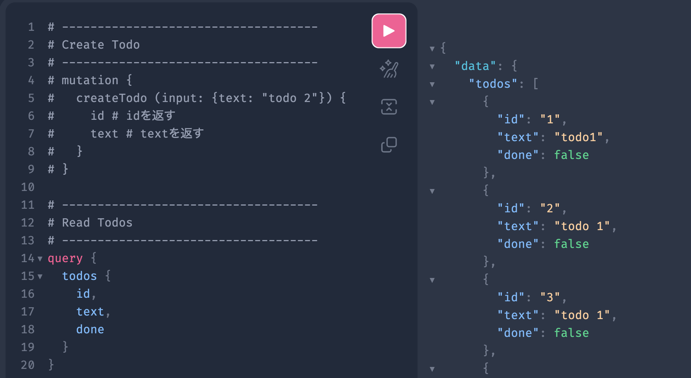

# GoでGraphQLを導入する

GoのGraphQLライブラリとして`gqlgen`があります

今回は`gqlgen`を使ってGraphQLのサーバーを立ち上げるまでのチュートリアルを作成していきます

### gqlgenのインストール
```
    go get github.com/99designs/gqlgen@latest
    go install github.com/99designs/gqlgen@latest

    go get github.com/99designs/gqlgen/graphql/handler
```

### GraphQLプロジェクトの作成

プロジェクトの初期化
```
    gqlgen init
```

デフォルトではこのような構成でファイルが生成されます

`graph/`は後で作り直すので，一旦削除しましょう

```
    .
    ├── gqlgen.yml
    ├── graph
    │   ├── generated.go
    │   ├── model
    │   │   └── models_gen.go
    │   ├── resolver.go
    │   ├── schema.graphqls
    │   └── schema.resolvers.go
    └── server.go
```

### GraphQL スキーマの定義

`gqlgen`は`*.graphqls`に記述したGraphQLのスキーマから，雛形となるコードを自動生成してくれます

`api/graph`ディレクトリを作成し，今回作成するGraphQLのスキーマとして`api/graph/todo.graphqls`を用意します

```todo.graphqls
    type Todo {
        id: ID!
        text: String!
        done: Boolean!
    }

    type Query {
        todos: [Todo!]!
    }

    input NewTodo {
        text: String!
    }

    type Mutation {
        createTodo(input: NewTodo!): Todo!
    }
```

このスキーマから雛形となるコードを自動生成してみましょう

自動生成されるコードの構成は`gqlgen.yml`で指定できます

今回は次の構成にしてみます

```gqlgen.yml
    # スキーマファイルへのパス
    schema:
        - api/graph/*.graphqls

    # 自動生成されるコード (サーバー内部の動作など)
    exec:
        filename: api/graph/generated.go
        package: graph

    # 自動生成されるコード (モデル)
    model:
        filename: api/graph/types.gen.go
        package: graph

    # 自動生成される雛形 (これを実装することになる)
    resolver:
        layout: follow-schema
        dir: internal/handler
        package: handler
        filename_template: "{name}.resolvers.go"

    (略)
```

変更した`gqlgen.yml`をもとにコードを再生成します

`server.go`がエラーを吐いてしまうので中身をすべてコメントアウトしておいたほうが良いかもしれません

```
    gqlgen generate
```

プロジェクトの構成を変えたので，合うように`server.go`を修正します
```server.go
    package main

    import (
        "log"
        "net/http"
        "os"

        "github.com/99designs/gqlgen/graphql/handler"
        "github.com/99designs/gqlgen/graphql/playground"
        "github.com/tf63/go-graph-exp/api/graph"         // 修正
        "github.com/tf63/go-graph-exp/internal/resolver" // 修正
    )

    const defaultPort = "8080"

    func main() {
        port := os.Getenv("PORT")
        if port == "" {
            port = defaultPort
        }

        srv := handler.NewDefaultServer(graph.NewExecutableSchema(graph.Config{Resolvers: &resolver.Resolver{}})) // 修正

        http.Handle("/", playground.Handler("GraphQL playground", "/query"))
        http.Handle("/query", srv)

        log.Printf("connect to http://localhost:%s/ for GraphQL playground", port)
        log.Fatal(http.ListenAndServe(":"+port, nil))
    }
```

次の構成になっているはずです
```
.
├── api
│   └── graph
│       ├── generated.go
│       ├── todo.graphqls
│       └── types.gen.go
├── gqlgen.yml
├── internal
│   └── resolver
│       ├── resolver.go
│       └── todo.resolvers.go
└── server.go
```

### Resolverの実装

いよいよResolverを実装していきましょう．`internal/resolver/`のファイルをいじっていきます

デフォルトでは次のようになっています

```resolver.go
    package resolver

    type Resolver struct{}
```

```todo.resolvers.go
    package resolver

    import (
        "context"
        "fmt"

        "github.com/tf63/go-graph-exp/api/graph"
    )

    // CreateTodo is the resolver for the createTodo field.
    func (r *mutationResolver) CreateTodo(ctx context.Context, input graph.NewTodo) (*graph.Todo, error) {
        panic(fmt.Errorf("not implemented: CreateTodo - createTodo"))
    }

    // Todos is the resolver for the todos field.
    func (r *queryResolver) Todos(ctx context.Context) ([]*graph.Todo, error) {
        panic(fmt.Errorf("not implemented: Todos - todos"))
    }

    // Mutation returns graph.MutationResolver implementation.
    func (r *Resolver) Mutation() graph.MutationResolver { return &mutationResolver{r} }

    // Query returns graph.QueryResolver implementation.
    func (r *Resolver) Query() graph.QueryResolver { return &queryResolver{r} }

    type mutationResolver struct{ *Resolver }
    type queryResolver struct{ *Resolver }
```

`todo.resolvers.go`の`CreateTodo`, `Todos`を実装していきます

本記事では，実際にDBに接続して動作するところまでは紹介しません

(Github上では実装しているので興味があれば)

```todo.resolvers.go
    // CreateTodo is the resolver for the createTodo field.
    func (r *mutationResolver) CreateTodo(ctx context.Context, input graph.NewTodo) (*graph.Todo, error) {
        // inputを元にTodoを生成
        // -----------------------------------
        // (今回は実装しません)
        // -----------------------------------

        // 作成したTodoを返す
        todo1 := graph.Todo{
            ID:   "1",
            Text: "todo 1",
            Done: false,
        }
        return &todo1, nil
    }

    // Todos is the resolver for the todos field.
    func (r *queryResolver) Todos(ctx context.Context) ([]*graph.Todo, error) {
        // テストデータを返す
        todos := []*graph.Todo{
            {ID: "1", Text: "todo 1", Done: false},
            {ID: "2", Text: "todo 2", Done: false},
            {ID: "3", Text: "todo 3", Done: false},
        }

        return todos, nil
    }
```

### GraphQLサーバーの起動

GraphQLのサーバーを起動してみます

`Dockerfile`を用意してあります (余計なポートまで空けていますが)
- https://github.com/tf63/go-graph-exp/blob/main/docker/backend/Dockerfile

```
    go run server.go
```

`http://localhost:8080`にアクセスするとGraphQL PlayGroundが表示されます


先程作成した`createTodo`を実行してみます

意味はないですが，引数には`text: "todo 1"`を指定します

```
    mutation {
        createTodo (input: {text: "todo 1"}) {
            id # idを返す
            text # textを返す
        }
    }
```
レスポンスが返ってきます
```
    {
        "data": {
            "createTodo": {
            "id": "1",
            "text": "todo 1"
            }
        }
    }
```

`query`も実行してみましょう
```
    query {
        todos {
            id,
            text,
            done
        }
    }
```

先程登録したテストデータが返ってきます
```
    {
        "data": {
            "todos": [
                {
                    "id": "1",
                    "text": "todo 1",
                    "done": false
                },
                {
                    "id": "2",
                    "text": "todo 2",
                    "done": false
                },
                {
                    "id": "3",
                    "text": "todo 3",
                    "done": false
                }
            ]
        }
    }
```

